# React2Shell: RCE 0-day in React Server Components

_CVE-2025-55182 (React) and CVE-2025-66478 (Next.js)_

**This repository contains exploit code for authorized security testing and educational purposes only.**

> **See also:** Multiple researchers have published analyses of this vulnerability. Check the [References](#references) section for additional perspectives, exploit techniques, and detection methods.

## What is it?

On Wednesday, December 3rd, 2025, a critical Remote Code Execution vulnerability in React Server Components was publicly disclosed. The bug, dubbed "React2Shell," allows an unauthenticated attacker to execute arbitrary code on any server running vulnerable versions of React RSC or Next.js App Router by sending a single HTTP request.

Given how ubiquitous Next.js has become - it powers a significant portion of the modern web - the impact of this vulnerability is severe. Any Next.js application using the App Router (the default for new projects since Next.js 13) with RSC enabled is vulnerable. No special configuration. No specific endpoints. Just a POST request to any route.

The vulnerability lives in React's "Flight" protocol, the serialization format used to pass data between server and client in React Server Components. A missing `hasOwnProperty` check during deserialization allows prototype chain traversal, ultimately reaching the JavaScript `Function` constructor to execute attacker-controlled code.

The flaw exists in React's `react-server-dom-webpack`, `react-server-dom-turbopack`, and `react-server-dom-parcel` packages. Next.js, as the dominant RSC consumer, inherits the vulnerability through its App Router.

## Who is impacted?

Many services are potentially vulnerable. Next.js is one of the most popular React frameworks, used by companies of all sizes - from startups to enterprises. The App Router with React Server Components has been the default architecture for new Next.js projects since version 13, meaning most modern Next.js deployments are affected.

Any application using:

- **React Server Components** with vulnerable `react-server-dom-*` packages (19.0.0 - 19.2.0)
- **Next.js App Router** versions 15.x (before 15.0.5) and 16.x (before 16.0.7)

This includes production deployments on Vercel, AWS, self-hosted infrastructure, and anywhere else Next.js App Router applications run.

**Not affected:**
- Next.js Pages Router applications (no RSC)
- Next.js 13.x and 14.x stable releases
- Applications using only React client-side rendering
- Edge Runtime deployments (no `process.mainModule` available)

## Affected Versions

### React Server Components

| Package | Vulnerable | Patched |
|---------|------------|---------|
| `react-server-dom-webpack` | 19.0.0, 19.1.0, 19.1.1, 19.2.0 | 19.0.1, 19.1.2, 19.2.1+ |
| `react-server-dom-turbopack` | 19.0.0, 19.1.0, 19.1.1, 19.2.0 | 19.0.1, 19.1.2, 19.2.1+ |
| `react-server-dom-parcel` | 19.0.0, 19.1.0, 19.1.1, 19.2.0 | 19.0.1, 19.1.2, 19.2.1+ |

### Next.js

| Version Line | Vulnerable | Patched |
|--------------|------------|---------|
| 15.0.x | < 15.0.5 | 15.0.5+ |
| 15.1.x | < 15.1.9 | 15.1.9+ |
| 15.2.x | < 15.2.6 | 15.2.6+ |
| 15.3.x | < 15.3.6 | 15.3.6+ |
| 15.4.x | < 15.4.8 | 15.4.8+ |
| 15.5.x | < 15.5.7 | 15.5.7+ |
| 16.0.x | < 16.0.7 | 16.0.7+ |

## Mitigation

**Upgrade immediately.** There are no workarounds.

For Next.js applications:
```bash
npm install next@latest
# or
pnpm update next
```

For direct React RSC usage:
```bash
npm install react-server-dom-webpack@latest
```

Verify your installed versions:
```bash
npm ls next react-server-dom-webpack react-server-dom-turbopack
```

## How the exploit works

### Exploit Requirements

1. A server running vulnerable React Server Components (via Next.js App Router or direct RSC usage)
2. Network access to send an HTTP POST request
3. That's it. No authentication. No specific endpoint. Any route works.

### The Attack

Multiple attack vectors have been discovered for this vulnerability. The most common - and the one that works without any prerequisites - uses prototype pollution via React's Flight protocol reference system.

The exploit sends a crafted multipart POST request with a `Next-Action` header. The payload abuses the reference system to:

1. Traverse the prototype chain via `$1:__proto__:then`
2. Construct a fake "chunk" object that mimics React's internal Chunk class
3. Trick the deserializer into calling the JavaScript `Function` constructor
4. Execute arbitrary code when the resulting function is invoked as a Promise thenable

```
POST / HTTP/1.1
Host: target.com
Content-Type: multipart/form-data; boundary=----Boundary
Next-Action: x

------Boundary
Content-Disposition: form-data; name="0"

{"then":"$1:__proto__:then","status":"resolved_model","value":"{...}","_response":{...}}
------Boundary
Content-Disposition: form-data; name="1"

"$@0"
------Boundary--
```

The code executes during deserialization, before any action ID validation occurs. This means any `Next-Action` header value triggers the vulnerable code path - no valid action ID is required.

> **Other attack vectors** exist, including `$F` function references and direct module gadgets. These typically require a valid action ID. See [Alternative Attack Vectors](#alternative-attack-vectors) for details.

### The Root Cause

React's Flight protocol resolves references like `$1:path:to:value` by splitting on colons and traversing the object:

```javascript
// ReactFlightReplyServer.js - getOutlinedModel()
for (let i = 1; i < path.length; i++) {
  value = value[path[i]];  // No hasOwnProperty check!
}
```

> **The Irony:** At the top of this very file, line 35:
> ```javascript
> import hasOwnProperty from 'shared/hasOwnProperty';
> ```
> The guard was imported. It was available. It just wasn't used in the one loop where it mattered most.

This single missing check allows `$1:__proto__:then` to traverse from a chunk object, up the prototype chain, to `Chunk.prototype.then` - a function that processes Promise-like objects. By crafting a fake chunk with the right properties, we control what code gets executed.

### Reproducing Locally

Clone the vulnerable test server:

```bash
git clone https://github.com/freeqaz/react2shell
cd react2shell/vulnerable-next-server
pnpm install
pnpm dev
```

In another terminal:

```bash
./detect.sh http://localhost:3443
```

A vulnerable server returns HTTP 500 with `E{"digest"` in the response body. To demonstrate RCE:

```bash
./exploit-redirect.sh http://localhost:3443 "id"
```

Command output appears in the response. For interactive exploration:

```bash
./shell.sh http://localhost:3443
```

## What's in This Repo

### Vulnerable Test Server

The `vulnerable-next-server/` directory contains a pre-configured Next.js 16.0.6 + React 19.2.0 application for safe local testing. It runs on port 3443 by default. This is a minimal App Router setup demonstrating that default configurations are vulnerable.

### Exploit Scripts

We developed multiple exploit variants to handle different scenarios:

| Script | HTTP | Output | Production | Notes |
|--------|------|--------|------------|-------|
| `exploit-redirect.sh` | 303 | `x-action-redirect` header | **Yes** | **Recommended.** No prerequisites. |
| `exploit-throw.sh` | 500 | Error response body | No | Dev mode only (errors sanitized in prod). |
| `exploit-blind.sh` | 200 | Server-side only | **Yes** | Fire-and-forget. Use for OOB exfil. |
| `exploit-urlencoded.sh` | 303 | `x-action-redirect` header | **Yes** | Different WAF signature. Requires action ID. |
| `exploit-reflect.sh` | 200 | Response body | **Yes** | Stealthiest. Requires action ID. |

> **Production Note:** React strips error messages in production builds, breaking the `throw` method. Only `exploit-redirect.sh` reliably captures command output in production without prerequisites. The redirect URL is stored in the error's `digest` property (metadata), which isn't sanitized - unlike `message` which becomes `{digest: "..."}` only.

**Utility Scripts:**
- `detect.sh` - Non-destructive vulnerability probe (no code execution)
- `enumerate-actions.sh` - Discovers valid Server Action IDs from target HTML
- `exfil-file.sh` - Chunked file exfiltration (auto-handles large files)
- `shell.sh` - Interactive pseudo-shell over RCE

The redirect method is recommended because it works in production, requires no prerequisites, and returns command output directly. It works by throwing a specially crafted `NEXT_REDIRECT` error - the output is base64-encoded into the redirect URL and returned in the `x-action-redirect` header.

For detailed usage of each script, see **[USAGE.md](USAGE.md)**.

## How to detect vulnerable servers

### Quick Detection

```bash
./detect.sh https://target.com
```

This sends a minimal probe that triggers the vulnerable code path without executing arbitrary code.

**Vulnerable server response:**
- HTTP status: 500
- Content-Type: `text/x-component`
- Body contains: `E{"digest"`

**Patched or non-RSC server:** Returns 404, different error format, or no Flight protocol response.

### Manual Detection

```bash
curl -s -o /dev/null -w "%{http_code}" -X POST https://target.com \
  -H "Next-Action: x" \
  -H "Content-Type: multipart/form-data; boundary=----Boundary" \
  --data-binary $'------Boundary\r\nContent-Disposition: form-data; name="0"\r\n\r\n["$1:a:a"]\r\n------Boundary\r\nContent-Disposition: form-data; name="1"\r\n\r\n{}\r\n------Boundary--'
```

This probe references a non-existent property on an empty object. Vulnerable servers crash trying to access `{}.a.a`, returning 500. Patched servers have a `hasOwnProperty` guard that prevents the crash.

### Identifying Next.js App Router

Look for these indicators:
- RSC payload in HTML: `<script>` tags containing Flight protocol data (`0:`, `1:`, etc.)
- `x-nextjs-cache` or `x-nextjs-matched-path` headers
- `/_next/` static asset paths
- Server Action IDs in HTML: `$ACTION_ID_` patterns in hidden form fields

## Technical Deep Dive

### The Attack Flow

The following diagram illustrates how a single HTTP request achieves remote code execution:

```mermaid
sequenceDiagram
    participant A as Attacker
    participant N as Next.js
    participant F as Flight Parser
    participant JS as JS Engine

    A->>N: POST with Next-Action header + malicious payload
    N->>F: Parse multipart form data
    F->>JS: await getRoot - returns chunk as thenable

    rect rgb(80, 20, 20)
        Note over F,JS: VULNERABILITY - No hasOwnProperty check
        JS->>F: chunk.then parses $1:__proto__:then
        F-->>F: Traverses to Chunk.prototype.then
    end

    F->>JS: resolve(attackerObject)
    Note over JS: JS Promise spec: resolve(thenable)<br/>calls thenable.then()
    JS->>F: fakeChunk.then() with attacker's _response

    rect rgb(80, 20, 20)
        Note over F,JS: EXPLOITATION - Attacker controls _response
        F->>F: $B0 → _formData.get(_prefix + "0")
        Note over F: _formData.get = Function constructor<br/>_prefix = malicious code string
        F->>JS: Function(code) invoked as thenable
    end

    Note over JS: RCE - execSync() runs

    rect rgb(20, 60, 20)
        Note over A,JS: OUTPUT EXFILTRATION (redirect method)
        JS-->>F: throw NEXT_REDIRECT with base64(output)
        F-->>N: Error propagates up
        N-->>A: HTTP 303 + x-action-redirect header
    end
```



### The Flight Protocol

React Server Components use a custom serialization format called "Flight" to stream component trees from server to client. It uses prefix codes for different value types:

- `$1`, `$2`, ... - References to other chunks by ID
- `$@0` - Raw chunk object reference (returns the chunk itself, not its value)
- `$B0` - Blob reference (triggers `_formData.get(_prefix + id)`)
- `$1:path:to:prop` - Traverses a path on a referenced chunk's value

The vulnerability exploits the combination of `$@` (raw reference) and colon-delimited paths to access `__proto__`.

### The Complete Attack Chain

**Phase 1: Request Processing**

1. POST with `Next-Action` header triggers RSC action handling
2. Busboy parses multipart form fields into chunk storage
3. `await getRoot(response)` returns chunk 0 as a thenable

**Phase 2: Prototype Traversal**

4. Chunk has a `then` method - JS Promise spec calls `thenable.then(resolve, reject)`
5. Our payload is parsed; `$1:__proto__:then` resolves to `Chunk.prototype.then`
6. Fake chunk object created with `then`, `status: "resolved_model"`, and `_response`

**Phase 3: Code Execution**

7. `resolve(ourObject)` triggers another `then()` call (JS thenable spec)
8. `Chunk.prototype.then` runs using our controlled `_response` object
9. `$B0` triggers `_formData.get(_prefix + "0")` - both attacker-controlled
10. Constructed Function called as thenable → **RCE**

**Phase 4: Output Exfiltration** *(optional, redirect method)*

11. Payload throws `NEXT_REDIRECT` error with base64-encoded command output
12. Next.js catches redirect, sets `x-action-redirect` header before URL validation
13. HTTP 303 returned to attacker with output in header

### Output Capture Strategies

The constructed Function is called as a thenable: `fn(resolve, reject)`. How we handle this determines whether we get output back:

| Strategy | Payload Suffix | How It Works |
|----------|---------------|--------------|
| **Blind** | `execSync('CMD');0` | Executes but never resolves - connection hangs, no output |
| **Throw** | `throw execSync('CMD').toString()` | Rejects Promise, output in error body (dev mode only) |
| **Redirect** | `throw {digest:'NEXT_REDIRECT;...;'+b64(output)}` | Abuses Next.js redirect handling, output in header |
| **Reflect** | `arguments[0]([execSync('CMD').toString()])` | Resolves Promise with output as action argument (requires valid action ID) |

**Recommended: Redirect.** Works in production, no prerequisites, output in `x-action-redirect` header.

The blind approach hangs because the Promise never settles - `await` blocks forever. This is useful for fire-and-forget scenarios (reverse shells, out-of-band exfil via `curl`).

### Alternative Attack Vectors

The core vulnerability has been exploited through three distinct attack classes. This repository uses the first approach; other PoCs demonstrate the alternatives:

| Attack Class | Mechanism | Action ID Required | Example PoC |
|--------------|-----------|-------------------|-------------|
| **Prototype Pollution** | `$1:__proto__:then` traversal to Chunk.prototype | No | react2shell, lachlan2k, joe-desimone |
| **$F Function Reference** | `$F1` + `action#constructor` to reach Function | Yes | shellinteractive |
| **Module Gadget** | `module#export` syntax (e.g., `child_process#execSync`) | Varies | ejpir research |

**Why prototype pollution doesn't require an action ID:** Multipart form parsing feeds chunks to the Flight deserializer immediately. RCE occurs in `getOutlinedModel()` during chunk reference resolution - before Next.js validates the action ID. URL-encoded requests validate the action ID first (different code path at `action-handler.ts:768`).

**Why $F reference requires an action ID:** The `$F` reference triggers `loadServerReference()`, which performs a manifest lookup. If the action doesn't exist, the request fails before code execution.

For detailed analysis of all PoC implementations and their tradeoffs, see [external-pocs/COMPARISON.md](external-pocs/COMPARISON.md).

## Production vs Development

React strips error details in production builds. This affects the throw-based exfiltration:

**Development:**
```json
{"digest":"...","name":"Error","message":"uid=501(free)...","stack":[...]}
```

**Production:**
```json
{"digest":"..."}
```

The redirect method bypasses this because the redirect URL is stored in the `digest` property, not `message`. The header is set unconditionally before URL validation, so even invalid URLs get the header set.

## Acknowledgments

The key exploitation insight - using `$@` raw chunk references to create a self-referential fake chunk - is credited to [maple3142](https://x.com/maple3142). The detection methodology referenced here comes from [Searchlight Cyber / Assetnote](https://slcyber.io/research-center/high-fidelity-detection-mechanism-for-rsc-next-js-rce-cve-2025-55182-cve-2025-66478/).

## References

**Official Disclosures:**
- [CVE-2025-55182](https://nvd.nist.gov/vuln/detail/CVE-2025-55182) - React Server Components RCE
- [CVE-2025-66478](https://nextjs.org/blog/CVE-2025-66478) - Next.js downstream impact
- [React Security Advisory](https://react.dev/blog/2025/12/03/critical-security-vulnerability-in-react-server-components) - Official React disclosure

**Community Research:**

| Author | Contribution | Attack Path | Notable Features |
|--------|--------------|-------------|------------------|
| [lachlan2k](https://github.com/lachlan2k/React2Shell-CVE-2025-55182-original-poc) | Original discoverer | Prototype pollution | Array.map chaining, 5-chunk structure, Waku support |
| [ejpir](https://github.com/ejpir/CVE-2025-55182-research) | Gadget research | All paths | Module gadget catalog, persistence attacks, data URI path |
| [joe-desimone](https://gist.github.com/joe-desimone/ff0cae0aa0d20965d502e7a97cbde3e3) | Python tooling | Prototype pollution | Reverse shell helper, callback exfil, timeout detection |
| [labubusDest / MrR0b0t19](https://github.com/MrR0b0t19/CVE-2025-55182-shellinteractive) | Interactive shell | $F function reference | Python REPL, file upload/download, built-in test suite |
| [Searchlight Cyber](https://slcyber.io/research-center/high-fidelity-detection-mechanism-for-rsc-next-js-rce-cve-2025-55182-cve-2025-66478/) | Detection methods | — | High-fidelity detection methodology, WAF signatures |

For detailed comparison of all PoC implementations, see [external-pocs/COMPARISON.md](external-pocs/COMPARISON.md).

**Background:**
- [React Flight Protocol](https://tonyalicea.dev/blog/understanding-react-server-components/) - Understanding RSC serialization

## License

Code is licensed under the [MIT License](LICENSE). Documentation (*.md files) is licensed under [CC-BY-SA 4.0](https://creativecommons.org/licenses/by-sa/4.0/).
